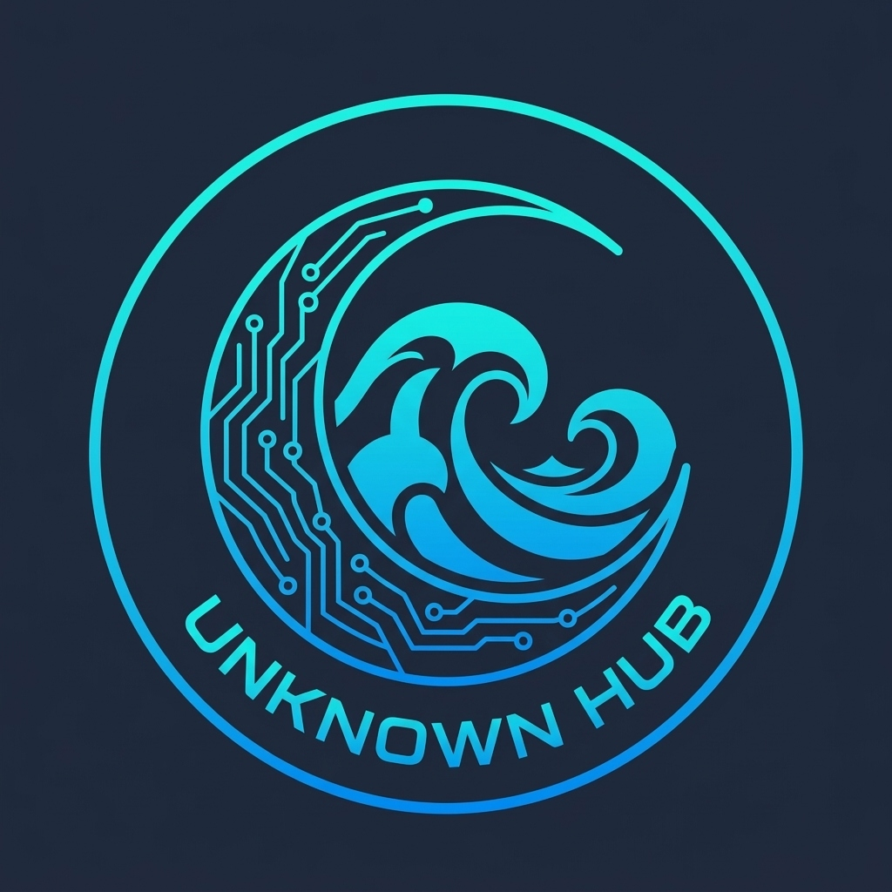

# Unknown Hub

<div align="center">



### Multi-game Roblox script hub & custom UI library.

</div>

---

## ⚡ Loadstring

Run this script in your executor:

```lua
loadstring(game:HttpGet("https://raw.githubusercontent.com/UnknownHQ/UnknownHub/main/Loader.luau"))()
```

---

## 🎮 Supported Games

- **Blox Fruits** (Auto Farm, Auto Stats, Fruit Sniper, ESP, Boss Farm, Teleports)
- **Slap Battles** (Slap Aura, Glove Farm, Badges, Anti-Ragdoll, Defense)
- **Bee Swarm Simulator** (Auto Farm, Sprout Farm, Vicious Bee, Token Link)
- **Booga Booga** (Auto Hit, Auto Pickup, Resource Whitelist, Godmode, ESP, TP)
- **Ink Game / Squid Games** (Minigame Automation, ESP, Godmode, Gamepass Unlocks)
- **+1 TNT Mining** (Auto Clicker, Auto Rebirth, Train & Upgrades)
- **Obby Creator** (Fly, Godmode, Checkpoint TP, Advanced Tools)
- **Universal** (Runs in any game with character tweaks, potato mode, 3D disabler, and tools)

---

## 📦 UI Library Usage

If you want to use the UI library for your own scripts:

```lua
local Library = loadstring(game:HttpGet("https://raw.githubusercontent.com/UnknownHQ/UnknownHub/main/UnknownLibrary"))()

local Hub = Library({
    title = "UNKNOWN HUB",
    subTitle = "v2.0",
    theme = Color3.fromRGB(0, 195, 245),
    secondaryTheme = Color3.fromRGB(165, 95, 255)
})

local Tab = Hub.createTabButton("Main", "Main", "rbxassetid://10723407389", true)
Hub.CreateSection(Tab, "Settings")

Hub.CreateToggle(Tab, "Auto Farm", false, function(state)
    print("Auto Farm:", state)
end)

Hub.CreateSlider(Tab, "Speed", 16, 150, 24, " studs", function(val)
    print("Speed:", val)
end)

Hub.CreateButton(Tab, "Click Me", function()
    print("Button clicked!")
end)
```

---

## 📄 License
MIT License
